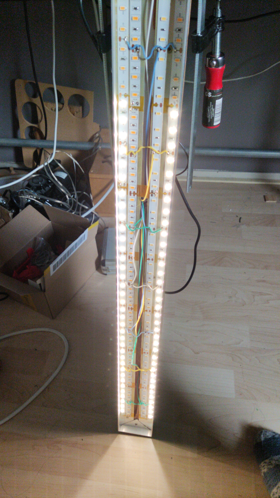
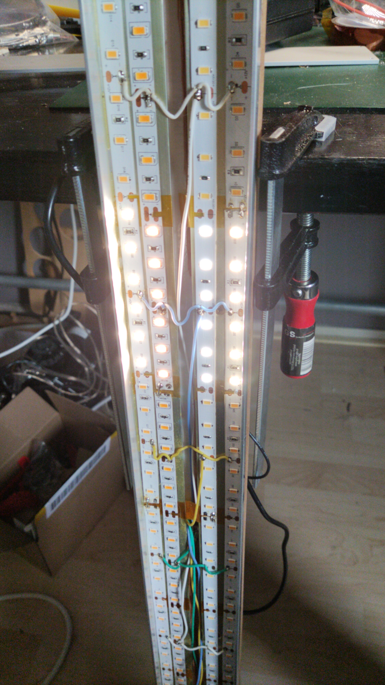
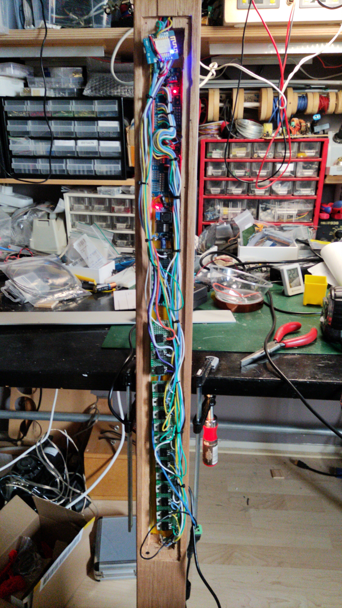
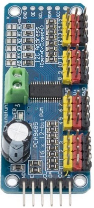

# DeskLight

(en)
## How it works

Just add a 12V 10A mains adapter and it should come up with its own wireless lan en connecting to it, you can configure it to work with you own WiFi.

After the setup the rotaty encoder has the following functions:
 - RGB led is off: you can dim the light
 - RGB led is green: you can set the starting position of the led segments
 - RGB led is purple: you can set the length of the segments
 - RGB led is blue: you can select witch ledstring you want to use, currently, any combination is possible
 - pressing the button for a longer period, the light goes soft of and the RGB led is breathing blueish
 
 ## Hardware requerements
 
Not a reguirement, but a given. Which all strings at full power it consumes about 100 W, this means that with four strings the total current per string is 2.1 A.

Requerements:
 - MUST HAVE cooling of the MOSFETS through the pcb, no additional cooling elements
 

(ger)
## Wie es funktioniert

Fügen Sie einfach einen 12-V-10-A-Netzadapter hinzu und es sollte über ein eigenes WLAN verfügen. Wenn Sie eine Verbindung herstellen, können Sie es so konfigurieren, dass es mit Ihrem eigenen WLAN funktioniert.

Nach der Einrichtung hat der Drehgeber folgende Funktionen:
 - RGB-LED ist aus: Sie können das Licht dimmen
 - RGB-LED ist grün: Sie können die Startposition der LED-Segmente festlegen
 - RGB-LED ist lila: Sie können die Länge der Segmente einstellen
 - RGB-LED ist blau: Sie können auswählen, welchen LED-Strang Sie verwenden möchten. Derzeit ist jede Kombination möglich
 - Durch längeres Drücken der Taste erlischt das Licht und die RGB-LED leuchtet bläulich
 
 ## Hardwareanforderungen
 
Keine Voraussetzung, sondern eine Selbstverständlichkeit. Da alle Strings bei voller Leistung etwa 100 W verbrauchen, bedeutet dies, dass bei vier Strings der Gesamtstrom pro String 2,1 A beträgt.

Anforderungen:
 - Die Kühlung der MOSFETS MUSS über die Platine erfolgen, keine zusätzlichen Kühlelemente

# LEDs wireing
The following pictures show the LED wireing

# Old Hardware
The wireing mess of the old Hardware, somewhere in there is a step down converter and ESP 32. The picture showed a version with an ESP 8266 witch died under misterious circomstances.

The following pwm controllers were used:

# Progress

Working:
  - dimming
  - start position
  - length of the leds on
  - colour temp of the leds
  - writing settings to flash
  - setup using web page
  - setup using AP mode
  - off mode (neopix is breathing white), not stored in nvs

Work in progress:
  - new circuit diagram
  
# Für die neue Hardware  
  
TODO (ger):
  - [ ] im schema: step-dowm-converter 3V3
  - [x] im schema:  Wiederstand zür Gate der MOSFETS sein für den ESP32, den PCA9685.
  - [ ] misst die Maximalwerte für die Leiterplatte
  - [x] ESP32-WROOM-32 module
  - [ ] den PWM-Code nach ledc* Functionen ändern (pwm1). Die PWM-Frequenz beträgt 1600 Hz.
  - [ ] unterschiedliche duty cycle pro LED-Streifen
  
MUST (ger):
  - im schema: 1K an der Gate von die Powermosfet wegen die Gate Subtrace Kapazität. Ohne dies kein korrektes PWM der LEDs
  
NICE TO HAVE (ger):
  - Geht das auch ohne PCA9685? Es müssen insgesamt 16 Ein-Aus-Ausgänge und 3 PWM-Ausgänge vorhanden sein. Letztere können unabhängig voneinander sein.